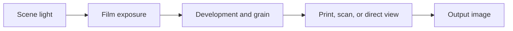

# Fotufilm engine

Fotufilm is an open-source film simulation engine for photos and video. It models
how light exposes photographic film, how the image develops into dye or silver,
and how that film becomes a print, scan, or viewed transparency. Colour, contrast,
grain, and halation follow the selected film's properties and the process used
to render it.

This repository includes the shared engine, a command-line tool, a Mac app,
plugins for DaVinci Resolve and Final Cut Pro, and a browser demo.

[Download for Mac](https://github.com/DhaliwalX/fotufilm-engine/releases/latest/download/Fotufilm-macOS.pkg) · [User guide](docs/documentation.html) · [](https://apps.apple.com/app/id6792911908)

## How the film model works

The model follows the stages between scene light and a finished photograph:



1. **Prepare the light.** The input is decoded into linear, wide-gamut RGB
   (Rec.2020), where pixel values represent light. Exposure and colour adjustments
   act here, before the film responds. Adding one stop of exposure doubles the
   light sent into the model.
2. **Expose the film.** The spectral model estimates a spectrum from RGB and
   evaluates the film's sensitivity at 81 wavelengths, from 380 to 780 nm in
   5 nm steps. Each layer records light according to its sensitivity. Emulsion
   diffusion spreads detail, while **halation** models light returning through
   the film base and exposing nearby areas, producing halos around bright sources.
3. **Develop the image.** Each layer's characteristic curve maps exposure to
   optical density: how much light the developed film blocks. The curve shapes
   shadow response, midtone contrast, and highlights. Where the stock supports
   them, interactions between developing layers and neighbouring areas also
   shape colour separation and edge contrast.
4. **Form the grain.** Grain varies the developed density according to the
   stock's granularity and density response. Grain size and spatial effects are
   expressed in physical film dimensions, then scaled to the image using the
   selected film format and frame coverage.
5. **View the result.** The output stage models how light passes through the
   developed film. A print medium adds its own spectral response and development
   curves; scan modes convert the negative to a positive. Reversal film produces
   a positive for direct viewing. The result is converted back to display colour.

These stages explain why the controls work together: exposure moves the image
along the film's response curve, film format changes the scale of its texture,
and the output medium helps determine the final colour and contrast.

## Profiles and model limits

Film stocks are data-driven profiles describing spectral sensitivity,
characteristic curves, dyes, grain, and spatial behaviour. The same engine reads
these properties for colour negative, black-and-white, and reversal films. See
[Included films](#included-films) and [Print media](#print-media) for the bundled
data and its sources.

The model combines published measurements with physical and statistical
approximations. RGB cannot uniquely recover the original scene spectrum, and
clipped highlights cannot supply missing exposure. Digitised curves are limited
by their source graphs and extrapolate beyond the published range. Grain models
describe aggregate texture rather than individual crystals. Results therefore
depend on the input, profile data, and viewing conditions as well as the model.

For a closer look at the implementation, start with the
[pipeline and controls](Sources/FotufilmCore/Pipeline.swift),
[spectral model](Sources/FotufilmCore/SpectralModel.swift), and
[film profile structure](Sources/FotufilmCore/FilmStock.swift).

## Build the engine

On a Mac, install Xcode 26 or newer and Halide:

```sh
brew install halide
swift build
swift test -c release --parallel
```

CI runs only when started manually in GitHub Actions.

If Halide is installed elsewhere, set `HALIDE_ROOT` to its installation folder.

List the included films or process an image from the command line:

```sh
swift run fotufilm --list-stocks
swift run fotufilm input.jpg output.jpg --stock gold200
```

## Build the Mac app and plugins

The Mac app targets Apple silicon and macOS 14 or newer.

```sh
macos/build.sh --test
```

Open `build/macos/Fotufilm.app`. The build also includes the Resolve plugin.
To include the Final Cut plugin, install Apple's FxPlug SDK first. See the
[Resolve guide](resolve/README.md) and [Final Cut guide](finalcut/README.md)
for separate builds and installation steps.

## Build the browser demo

Install Emscripten and Python 3.10 or newer. Set `EMSDK_ROOT` to your Emscripten
SDK folder, or install it at `build/emsdk`. Then run:

```sh
tools/build-wasm.sh
cd web
npm ci
npm run build
```

The output is in `web/dist`. Set `FOTUFILM_BASE=/demo/` when running `npm run build`
to host the demo at [fotufilm.com/demo](https://fotufilm.com/demo/).
The demo develops an image at its own size, up
to about 120 megapixels, cutting it into tiles with overlap for both film development
and print blur that the kernel runs one at a time;
the pack carries its spatial parameters for a ladder of frame sizes so grain
and halation stay the size the emulsion makes them. The demo uses the CPU when
a WebGPU-compatible Halide toolchain is not available. To build one, install Homebrew's `llvm` and
`lld` and run `tools/build-halide.sh --webgpu` first; it fetches the Halide
pull request the browser runtime needs and applies the patches in `tools/`.

## Included films

Default source builds include all 40 film profiles, free to use without activation.
The runtime JSON profiles are available in `Sources/FotufilmCore/Stocks/` under
[CC BY-SA 4.0](licenses/FILM-PROFILES.txt). You may modify and redistribute them
with attribution and ShareAlike terms. This licence does not apply to rendered
photos or videos. The engine code uses Apache-2.0.

Thirty-three profiles carry sampled characteristic curves with smooth interpolation
through every validated digitized point. Source tracing variations are retained;
response outside each published range is extrapolated. These schema version 2
profiles require a build with sampled-curve support. Schema version 1 remains supported.

The CLI and tests also include synthetic films. The demo uses a generated colour chart.
See [Build support](docs/support.html) for stock-pack setup.

## Print media

The output media are digitised from the manufacturers' own published datasheets, on the
same 380-780 nm grid at 5 nm the film model uses. Each carries the sheet's dye spectra,
layer sensitivities and characteristic curves.

| Medium | Source |
| --- | --- |
| Kodak Ektacolor Edge | Kodak E-7020 (April 2019) |
| Kodak Professional Endura Premier | Kodak E-4070 (March 2013) |
| Fujicolor Crystal Archive Type CA | Fujifilm AF3-0250U2 (November 2018) |
| Kodak Vision 2383 | Kodak H-1-2383 (March 2022) |
| Kodak Vision Premier 2393 | Kodak 2393 curve sheets |
| Fujifilm ETERNA-CP 3513DI | Fujifilm ETERNA-CP 3513DI brochure |

A sheet that publishes one characteristic curve develops all three records along it;
E-7020, E-4070, 2383, 2393 and ETERNA-CP publish three and are carried per record. The lab scan and
telecine are inversions rather than sheets, and are described in `PrintPaperTables.swift`.

Release prints time mid-grey at approximately 1.0 D above clear film (LAD, 10%
transmission), independently of the camera stock. Reflection papers retain 0.744 D
(18%). Release printing uses an approximate UV-blocked tungsten RGB additive head;
the passbands are not measured printer-filter spectra. ETERNA-CP's published Gray
and dye sum remain inconsistent with a non-negative additive base, so its neutral
spectral calibration remains uncertain.


`SOURCE_ASSETS.json` records where assets came from and their file hashes. Before
adding data or images, run `python3 tools/check-source-boundary.py`.

To convert a scan, choose **File → Import Scanned Negative…**, sample its clear film
border and preview the positive. Import it to adjust all four crop corners independently.
See the [scan import guide](docs/scanned-negatives.md) for input requirements and
the approximate conversion’s limits.

## More information

- [User guide](docs/documentation.html)
- [Build support](docs/support.html)
- [Licensing](LICENSING.md)
- [Third-party notices](THIRD_PARTY_NOTICES.md)

The engine, Mac app, and plugins use [Apache-2.0](LICENSE). Film profiles have
[separate licences](LICENSING.md).
